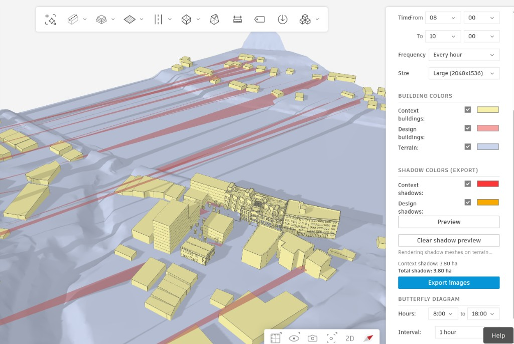
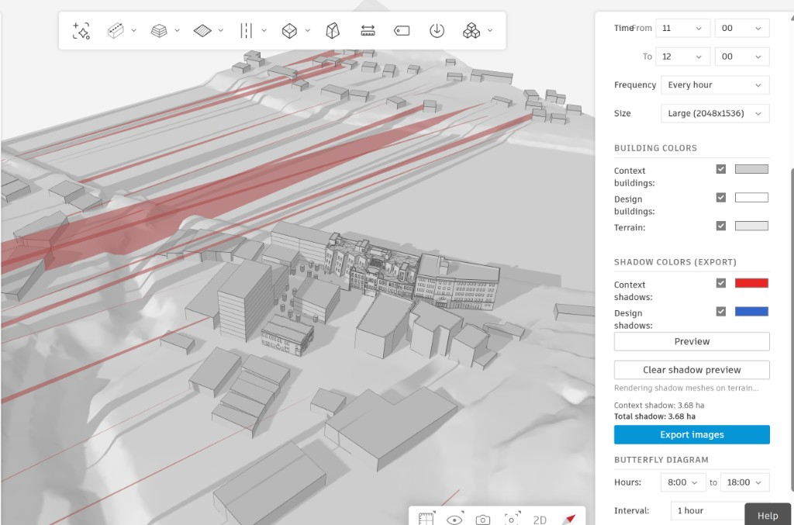
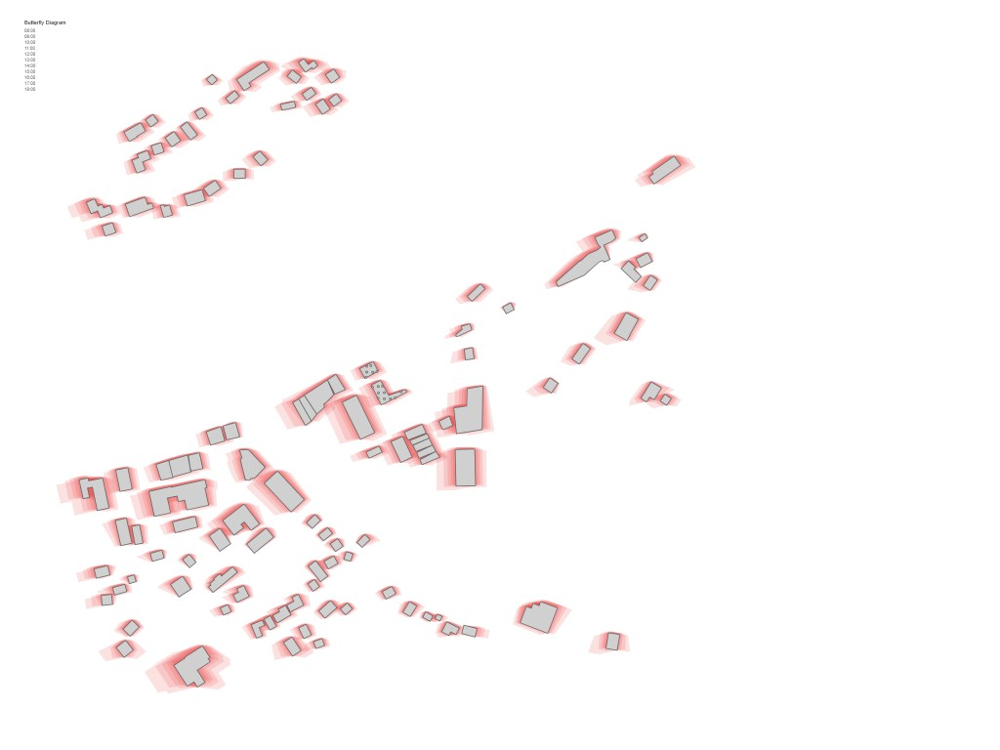
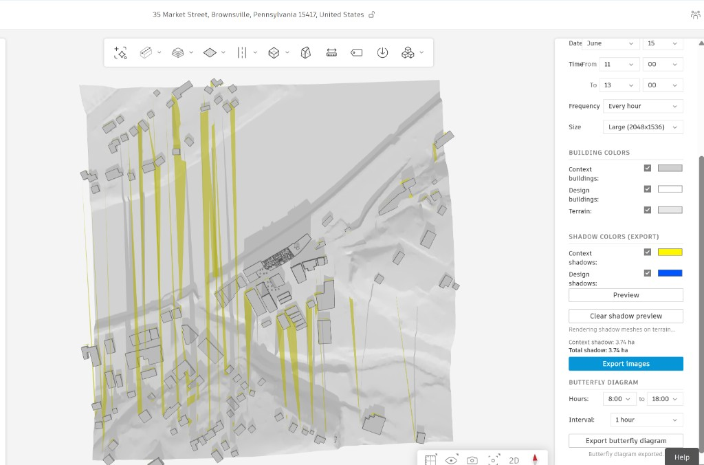

# Shadow Algorithm Development: Iteration Log

**Project**: Forma Site Design Shadow Study Extension — Version 1  
**Date**: March 16–18, 2026  
**Team**: Product experts (non-developers) working with AI coding agent (Claude) in Cursor IDE  
**Chat reference**: [Shadow Extension V1 Build](18eaf9ca-c089-48a5-b300-01c3da956287)

---

## Context

This document captures the iterative test-rewrite cycle for the shadow casting algorithm. The team consists of product managers and product experts — not software engineers — collaborating with an AI agent to build a Forma extension. The process shows how non-developers can effectively steer technical implementation through visual testing and domain feedback, even when the AI agent's initial approaches are wrong.

---

## Phase 1: Initial Implementation — Approach C (Per-Vertex Terrain Projection)

### What was built

After exploring pixel-differencing (Approach A) and sun-analysis grids (Approach B), the team decided on "Approach C": computing shadow geometry from building footprints using vector math. The initial implementation:

1. Extracted building footprints via `Forma.geometry.getFootprint()`
2. Derived building heights from `Forma.geometry.getTriangles()` mesh data
3. Computed sun position using `suncalc` library + `Forma.project.getGeoLocation()`
4. **Projected each footprint vertex independently** to where its shadow ray hit the terrain
5. Used `Forma.terrain.getElevationAt()` for terrain-aware projection
6. Combined original + projected footprints via polygon boolean union (`polyclip-ts`)

The per-vertex terrain projection used an **iterative convergence** algorithm: for each vertex, cast a ray from the building top along the sun direction, sample terrain elevation at the projected point, recalculate, and repeat until the ray converges with the terrain surface.

### Test result: Shadows stretching to infinity



**User feedback**: *"The shadows projected down onto the 0 elevation seems to make the functionality unusable, we need to solve for projecting onto the terrain"* ... *"Shadows seem to be stretching off to infinity, I think there is a problem"*

**What went wrong**: The iterative convergence algorithm diverged on downhill slopes. Each iteration saw a larger elevation drop at the projected point, which pushed the endpoint further downhill in a positive feedback loop. On sloped terrain in Brownsville, PA, this caused shadows to stretch hundreds of meters — far beyond any physically reasonable length.

---

## Phase 2: Fix Attempt — Ray Marching with Binary Search

### What changed

The AI agent replaced the iterative convergence with a **ray marching + binary search** algorithm:

- March along the shadow ray in fixed steps (every few meters)
- At each step, check: has the ray dropped below the terrain surface?
- When it has, binary-search between the last-above and first-below points for a precise intersection
- Added `MAX_SHADOW_DISTANCE = 1500m` and `MIN_SUN_ALTITUDE = 0.035 rad` guards
- Added terrain-anchored ray origin: query terrain at the building vertex itself, then start the ray at `terrainAtVertex + meshHeight`

### Test result: Still elongated, not following terrain



**User feedback**: *"Still very bad shadows, elongated and not following the terrain"*

**What went wrong**: Two compounding issues:

1. **Non-building elements treated as buildings**: The element classifier returned everything in the scene — terrain patches, roads, landscape features. These had large z-ranges (terrain height difference across a patch) and were treated as tall buildings, casting wildly long shadows.

2. **`getElevationAt` inconsistency**: The terrain API returned values that didn't align with the mesh coordinate system, or returned 0 on failure. Since each vertex was projected independently, some vertices landed correctly while others diverged, producing distorted parallelograms.

### Butterfly diagram — a clue



**User feedback**: *"The butterfly diagram seems close, although it's missing the design geometry"*

The butterfly diagram (2D plan-view rendering) looked much more reasonable. This was a hint: the 2D shadow *shapes* were close to correct, but projecting them onto terrain in 3D was where things broke.

---

## Phase 3: Fix Attempt — Terrain-Anchored Origin + Element Filtering

### What changed

1. **Element filtering**: Added minimum height (2.5m) and maximum footprint area (50,000 m²) filters to exclude terrain patches, roads, and landscape elements from shadow computation.

2. **Terrain-anchored ray origin**: Instead of using the mesh's absolute `topZ` as the ray start (which depended on the mesh coordinate system matching the terrain API), the algorithm now queried terrain at the building vertex and started the ray at `terrainAtVertex + meshHeight`. This made shadow length depend only on the mesh's *relative* height, not its absolute z-position.

### Test result: Still elongated



**User feedback**: *"There's still some extremely elongated shadows. Maybe there's a fundamentally different approach?"*

**What went wrong**: The per-vertex terrain projection approach was inherently fragile. Even with a terrain-anchored origin, individual vertices could land at wildly different distances depending on:
- Local terrain slope variations between adjacent vertices
- `getElevationAt` returning inconsistent values for nearby points
- Points projected beyond the terrain mesh boundary getting fallback elevation of 0

Each vertex being projected independently meant the shadow polygon's shape was at the mercy of terrain API behavior at N different locations. No amount of guards, fallbacks, or clamping could make this robust.

---

## Phase 4: Research — How Do Established Tools Do This?

### User prompt

*"Maybe there's a fundamentally different approach? Can you do a little more research in ways to do vector-based shadow casting"*

### Research findings

The AI agent studied the source code and documentation of three established shadow tools:

1. **pybdshadow** (Python/GIS, BSD-3 license): Open-source, used in academic urban planning research. Source code inspected directly from GitHub.

2. **R shadow package** (`shadowFootprint` function): Used in precinct-scale urban shadow studies. Documented in the Journal of the Royal Statistical Society.

3. **ArcGIS Sun Shadow Volume**: Esri's commercial implementation.

**The universal pattern**: All three tools compute shadows on a **flat horizontal plane** using a **uniform offset** per building. Terrain is only involved in the *rendering* step (draping the flat shadow mesh onto the 3D terrain surface), never in the *computation* step.

### The pybdshadow algorithm (from source inspection)

From `calSunShadow_vector()` in `pybdshadow/pybdshadow.py`:

```python
distance = shapeHeight / math.tan(altitude)
lonDistance = distance * math.sin(azimuth)
latDistance = distance * math.cos(azimuth)

# For each wall edge: create a parallelogram from original + offset endpoints
shadowShape[:, 0:2, :] += shape                    # original points
shadowShape[:, 2:4, 0] = shape[:, :, 0] + lonDistance  # offset x
shadowShape[:, 2:4, 1] = shape[:, :, 1] + latDistance  # offset y
```

Key insight: **every vertex gets the exact same offset vector**. The displaced footprint is a congruent copy of the original, just shifted. This guarantees well-formed polygons regardless of terrain.

---

## Phase 5: Uniform-Offset Algorithm — Implementation

### The plan

Replace per-vertex terrain projection with the industry-standard uniform-offset approach:

1. For each building, compute **one** shadow displacement vector:
   - `distance = height / tan(sun_altitude)` (capped at 800m)
   - `dx = distance * sin(sun_azimuth)`
   - `dy = distance * cos(sun_azimuth)`
2. Offset the **entire** footprint polygon by `(dx, dy)`
3. Shadow = `union(original, offset copy, connecting quads)`
4. Terrain draping is **purely a rendering concern** — the `TerrainSampler` moves from shadow computation to mesh rendering only

### Files changed

| File | Change |
|------|--------|
| `shadow-geometry.ts` | Complete rewrite. Replaced async per-vertex projection with synchronous uniform offset. Removed `TerrainSampler` dependency entirely. |
| `shadow-pipeline.ts` | Removed `TerrainSampler` from computation path. `computeAllBuildingShadows` is now synchronous. |
| `shadow-preview.ts` | No changes — `TerrainSampler` used only for mesh z-draping (correct). |
| `shadow-export.ts` | No changes — same pattern as preview. |
| `butterfly-diagram.ts` | No changes — consumes pipeline output. |
| `building-geometry.ts` | Kept element filters from Phase 3 (min height 2.5m, max area 50k m²). |

### Why this is better

- **Zero terrain sensitivity during computation**: Shadow shapes don't depend on terrain API behavior
- **Deterministic**: Same inputs always produce the same polygon
- **Fast**: No async terrain queries during the heavy loop — just arithmetic
- **Proven**: Exact algorithm used by pybdshadow, R shadow, ArcGIS, SketchUp

### Known limitation

On steeply sloped terrain (>20%), flat-plane shadows deviate from physical reality by a few percent. This is a known and accepted trade-off in every major shadow study tool. For regulatory submittals, it is standard practice.

---

## Lessons Learned

### For AI-assisted development with non-developer teams

1. **Visual testing is the fastest feedback loop.** Every screenshot the user shared immediately identified whether the algorithm was working. No logs, no debugger — just "does this look right?" This is a powerful pattern for non-developers steering AI implementation.

2. **Domain expertise matters more than code expertise.** The user knew that the shadows looked wrong long before any technical analysis. They also knew to ask "is there a fundamentally different approach?" when incremental fixes weren't working. This is the product expert's superpower.

3. **AI agents over-engineer when they should research first.** The initial per-vertex terrain projection was a novel algorithm that no established tool uses. The AI should have studied existing implementations (pybdshadow, R shadow) before inventing a new approach. The final solution is dramatically simpler than any of the intermediate attempts.

4. **Fixing symptoms vs. root causes.** Three iterations of fixing the per-vertex approach (iterative convergence → ray marching → terrain-anchored origin) each addressed symptoms while the root cause — per-vertex independence — persisted. The fix was architectural, not incremental.

5. **Separate computation from rendering.** The clean separation (2D shadow geometry on a flat plane, then drape onto terrain for 3D display) is both more robust and more flexible. This is a general principle: compute in the simplest coordinate system possible, then transform for display.

### For shadow study extensions specifically

- Building height from mesh data (`getTriangles`) is the z-range of vertices, which is reliable
- Element filtering (min height, max area) is essential to avoid treating terrain/roads as buildings
- The `suncalc` library is accurate and well-tested for sun position
- `polyclip-ts` handles polygon boolean operations reliably
- `Forma.terrain.getElevationAt` is useful for rendering but unreliable as a computation input
- Design vs. context classification requires buildings to have Functions assigned in Forma

---

## Timeline

| When | What | Result |
|------|------|--------|
| Mar 16 | Approach C: per-vertex terrain projection | Shadows stretch to infinity on slopes |
| Mar 18 AM | Fix: ray marching + binary search | Still elongated, terrain inconsistency |
| Mar 18 AM | Fix: terrain-anchored origin + element filtering | Still elongated for some buildings |
| Mar 18 PM | Research: studied pybdshadow, R shadow, ArcGIS | Found uniform-offset as industry standard |
| Mar 18 PM | Rewrite: uniform-offset algorithm | Clean shadows, ready for testing |
